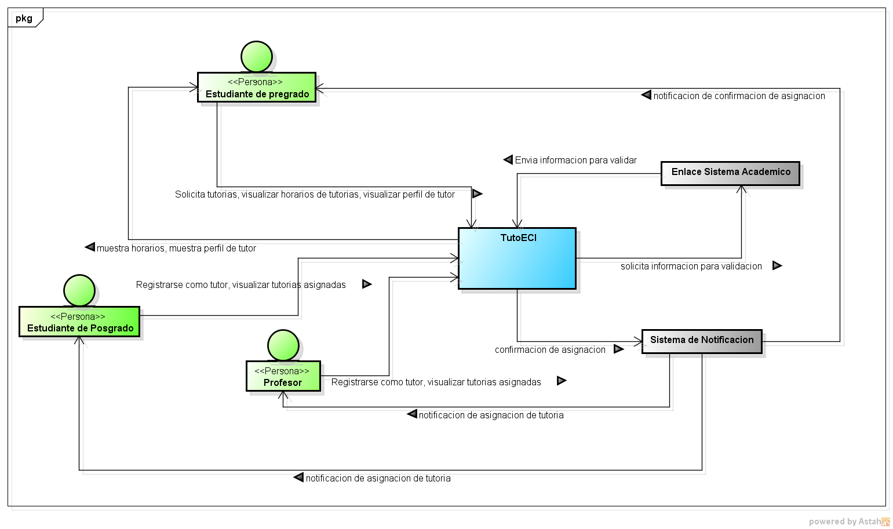

# DOSW_ParcialT1_JuanNieto.

## Analisis inicial de caso de estudio - TutoECI

### Diagrama de Contexto C4

## Requerimientos

#### Funcionales

- Los solicitantes deben poder pedir tutorias indicando una preferencia de tutor.
- Los solicitantes deben poder solicitar el perfil de un tutor.
- Los profesores y estudiantes de posgrado deben poder registrarse como tutor, siguiendo sus respectivas reglas.

#### No funcionales

- El diseño de la interfaz debe incorparar la indentidad visual institucional, con la paleta de colores del programa de sistemas.
- Debe emplear una tipografia legible con los estandares minimos de contraste y accesibilidad web(WCAG 2.1 Nivel AA) para facilitar lectura de horarios de tutoria y perfiles de tutores.

### Historias de Usuario

|**Funcionalidad**|**Historia de Usuario**|**Criterios de aceptacion**|
|:---:|---|---|
|**Solicitar tutoria segun la preferencia**|COMO estudiante de pregrado, QUIERO solicitar una tutoria indicando mi preferencia de tutor (profesor o estudiante de posgrado), para que el sistema me asigne el mejor tutor disponible.|Debe retornar un tutor asignado basandose en 3 preferencias de busqueda: 1. **FASTEST_AVAILABLE**: El usuario quiere la tutoría lo antes posible. Se descartan tutores no disponibles y se selecciona el que tenga el horario libre más próximo, sin importar si es profesor o posgrado. 2. **EXPERT_FIRST**: Prioriza profesores. Se busca primero en la lista de profesores de esa materia; si hay disponibles, se asigna el más próximo. Si no hay profesores disponibles, se busca entre los estudiantes de posgrado. 3. **PEER_TUTORING**: El estudiante prefiere aprender de otro estudiante. Se descartan los profesores por completo y se selecciona el estudiante de posgrado disponible qupertenezca al mismo programa académico del solicitante.|
|**Visualizar el perfil de un tutor**|COMO estudiante de pregrado QUIERO Visualizar el perfil de un tutor indicado PARA PODER determinar sus capacidades y determinar si estoy conforme con mi asignacion.| Debe retornar un String que muestre:  O. Nombre del tutor. O. Materias que pueden tratar. O. Carreras de la que pueden hablar. |
|Registrarse como tutor|COMO estudiante de posgrado QUIERO registrarme como tutor segun PARA PODER dar tutorias a los estudiante que los neseciten segun mis materias y mis programas academicos|Debe quedar en guardado en el sistema, con su nombre, materias a tratar y programas academicos que puede tratar.|
|Registrarse como tutor|COMO Profesor QUIERO registrarme como tutor segun PARA PODER dar tutorias a los estudiante que los neseciten segun mis materias|Debe quedar en guardado en el sistema, con su nombre, materias asignadas.|

### Diagrama de casos de uso

## Planeacion Agil

### Epic

### Story

### Tasks

**URl jira:** https://dosw2026-2.atlassian.net/jira/software/projects/DPT/boards/3?atlOrigin=eyJpIjoiYjcyOWYxNTJmYjFlNDhjMmE5MTIxNDhmMTk1MDQwZTQiLCJwIjoiaiJ9

## Patrones de diseño

### Patron: Strategy

### Tipo de patron: Comportamiento

Se desea utilizar este patron para la los algoritmos de seleccion de tutor segun la preferencia del usuario, permitiendo asi que la funcionalidad no tenga que hacer if's segun la preferencia del usuario, unicamente, que deba elegirlo y la funcionalidad solo ejecuta el algoritmo de seleccion para esa preferencia con una clase concreta que implementa a una interfaz de seleccion.

### Patron: Facthory Method

### Tipo de Patron: Creacional

Se desea utilizar este patron para la creacion de tutores, de esta manera solo se tendra una interfaz de tutor para que las clases concretas que puedan ser tutores, la implementen y luego al momento de crear un tutor, no se deba preocupar el usuario por si es estudiante de posgrado, o profesor, unicamente de que sea tutor y sus acciones procedentes con el, controlando if's y manteniendo una mejor disposicion.

