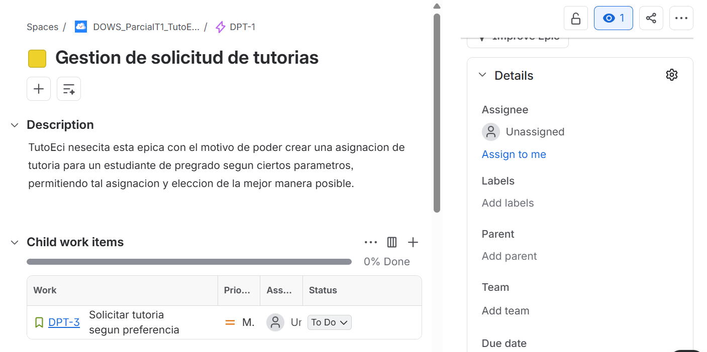
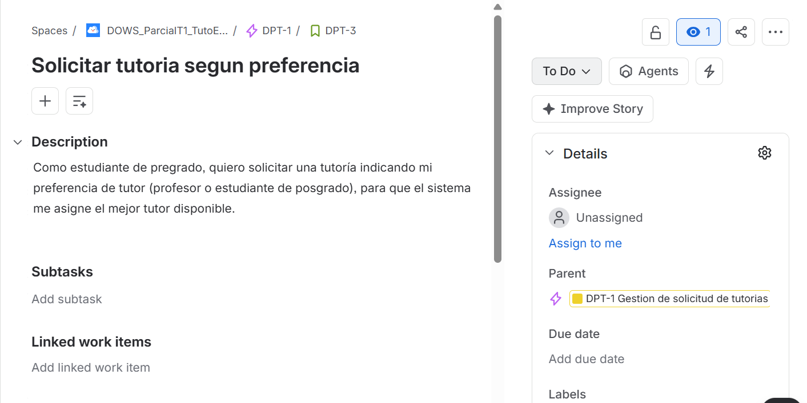
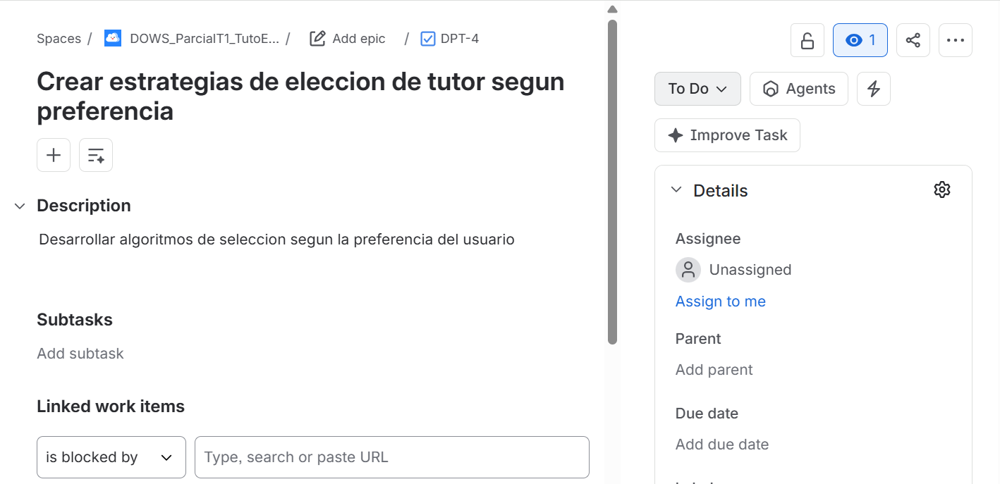
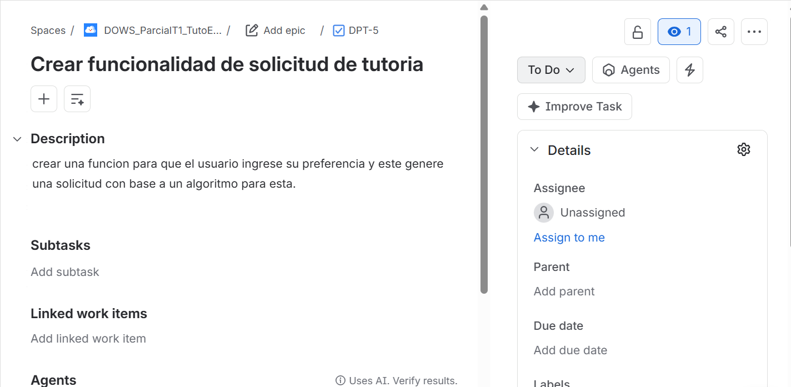
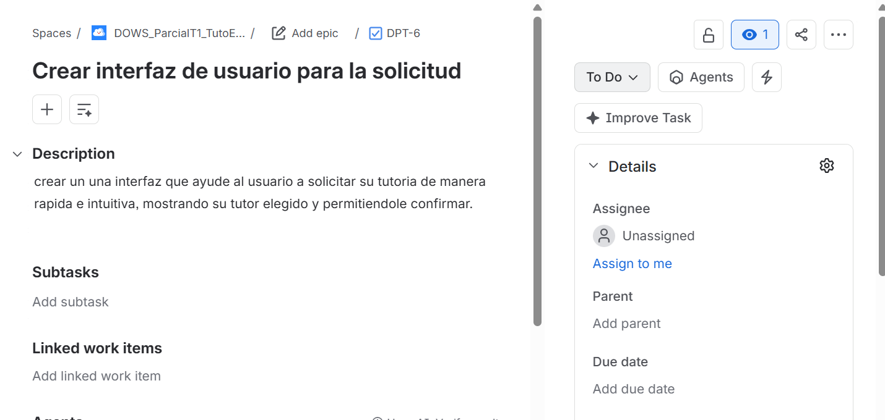

# DOSW_ParcialT1_JuanNieto.

## Requerimientos

### Funcionales

- Los solicitantes deben poder pedir tutorias indicando una preferencia de tutor.
- Los solicitantes solo pueden tener tutorias de materias en las que estan inscritos activamente.
- Los profesores y estudiantes de posgrado deben poder ser tutores, siguiendo sus respectivas reglas.

### No funcionales

- El diseño de la interfaz debe incorparar la indentidad visual institucional, con la paleta de colores del programa de sistemas.
- Debe emplear una tipografia legible con los estandares minimos de contraste y accesibilidad web(WCAG 2.1 Nivel AA) para facilitar lectura de horarios de tutoria y perfiles de tutores.

## Planeacion Agil

### Epic

### Story

### Tasks

**URl jira:** https://dosw2026-2.atlassian.net/jira/software/projects/DPT/boards/3?atlOrigin=eyJpIjoiYjcyOWYxNTJmYjFlNDhjMmE5MTIxNDhmMTk1MDQwZTQiLCJwIjoiaiJ9